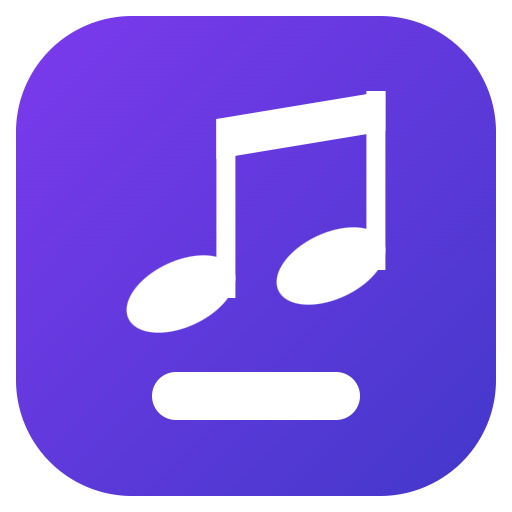

# Lyra



Trình nghe nhạc cho Windows 11: phát nhạc offline trong máy và stream online, kèm khung **lyric nổi trong suốt** luôn hiển thị trên màn hình.

Tên lấy từ chòm sao Thiên Cầm — cây đàn lia. Logo là nốt móc kép đặt trên một thanh lời: nhạc, và lời chạy bên dưới. Bản gốc nằm ở `resources/icon.svg`; sửa file đó rồi chạy `npm run icon` để xuất lại PNG, electron-builder tự dựng `.ico` đa cỡ từ đấy.

## Chạy thử

```bash
npm install
npm run dev        # chế độ phát triển (hot reload)
```

Lần đầu `npm install` trên npm 11 có thể chặn install script của Electron. Nếu gặp, chạy:

```bash
npm install-scripts approve electron esbuild electron-winstaller
npm install
```

Các lệnh khác:

| Lệnh | Việc |
|---|---|
| `npm run build` | Build 3 bundle (main / preload / renderer) vào `out/` |
| `npm run dist` | Đóng gói installer NSIS + bản portable vào `release/` |
| `npm run typecheck` | Kiểm tra kiểu cả hai phía |
| `npm test` | 73 test. Gồm test đơn vị (parse `.lrc`, thuật toán căn mốc), test scheme `media://`, và test đầu-cuối bật app thật qua CDP: quét thư viện → phát ra tiếng → lyric chạy → playlist → bắt được nhạc từ app khác → đường đi dịch lyric |
| `npm run test:download` | Tải thật một bài từ NCT và Zing rồi kiểm tra file, tag, ảnh bìa, `.lrc` (cần mạng) |
| `npm run test:whisper` | Đo độ chính xác căn mốc: tải bài có `.lrc` chuẩn làm đáp án, bóc timestamp đi, bắt AI dựng lại rồi so sai số (cần mạng, mất vài phút) |
| `npm run tune:align` | Chạy Whisper một lần rồi thử nhiều biến thể thuật toán căn chỉnh trên cùng dữ liệu |
| `npm run probe` | Gọi thật các nguồn online để xem nguồn nào còn chạy |
| `npm run dig-nct` | Khi NhacCuaTui hỏng: bóc bundle JS của họ để tìm lại API |
| `npm run icon` | Xuất `resources/icon.svg` thành `icon.png` 512 px |

## Tính năng

### Nhạc offline
- Thêm thư mục → quét đệ quy, đọc tag ID3 (tên bài, nghệ sĩ, album, ảnh bìa, lyric nhúng).
- Quét lại chỉ đọc lại file có `mtime` thay đổi nên rất nhanh từ lần thứ hai.
- Kéo thả file nhạc thẳng vào cửa sổ để thêm lẻ.
- Hỗ trợ mp3, flac, m4a, aac, ogg, opus, wav, wma, aiff.
- File local được phục vụ qua scheme riêng `media://` có xử lý HTTP Range, nên tua vẫn mượt với file lớn.

### Nhạc online
| Nguồn | Tìm kiếm | Phát | Lyric riêng | Trạng thái (đã gọi thật 29-08-2026) |
|---|---|---|---|---|
| Zing MP3 | ✅ | ✅ | ✅ có timestamp | Chạy tốt. Bài VIP báo lỗi rõ ràng. |
| NhacCuaTui | ✅ | ✅ | ✅ có timestamp | Chạy tốt. |
| YouTube | ✅ | ✅ | — | Chạy tốt. Cần `yt-dlp` — vào **Cài đặt → YouTube → Tải yt-dlp tự động**. |
| URL / Radio | — | ✅ | — | Chạy tốt. Dán thẳng link mp3, m3u8, icecast/shoutcast. |
| Spotify | ✅ | ❌ | — | Chỉ tra cứu metadata — API công khai không cho stream audio. Cần Client ID/Secret của bạn. |

> **Zing MP3 và NhacCuaTui không có API công khai.** Phần này gọi API nội bộ của web họ, nên **có thể hỏng khi họ đổi phía server**. Lỗi hiện thành một dòng cảnh báo trong kết quả tìm kiếm chứ không làm sập app hay ảnh hưởng nguồn khác. Chạy `npm run probe` để kiểm tra nguồn nào còn sống.

### Lời bài hát
Thứ tự ưu tiên khi tìm lyric:

1. **Bản bạn tự nhập** trong app (luôn thắng)
2. **File `.lrc`** cùng tên nằm cạnh file nhạc (hoặc trong thư mục con `lyrics/`)
3. **Tag nhúng** trong file — kể cả tag đồng bộ `SYLT`
4. **Cache** LRCLIB đã tải trước đó
5. **LRCLIB** trên mạng — miễn phí, không cần API key

Zing MP3 và NhacCuaTui có `.lrc` chuẩn của riêng họ nên được dùng trước LRCLIB cho bài từ hai nguồn đó (đã thử: Zing 119 dòng, NCT 60 dòng, đều có timestamp).

Ngoài ra:
- Lyric có timestamp thì tự cuộn và làm nổi dòng đang hát; bấm vào một dòng để nhảy tới đúng đoạn đó.
- Nút `−` / `+` chỉnh lệch thời gian theo từng 0.5 giây, lưu riêng cho từng bài.
- Hộp **Sửa lyric** cho dán lyric tay, kèm nút chèn mốc thời gian tại vị trí đang phát để tự canh timestamp.

### Lyric nổi trên màn hình
Một cửa sổ riêng, không khung, **nền trong suốt tuyệt đối**, luôn nổi trên mọi cửa sổ khác — kể cả game và video toàn màn hình (`alwaysOnTop` mức `screen-saver`).

- Bật/tắt bằng nút **Lyric nổi** trên thanh tiêu đề, menu chuột phải ở khay hệ thống, hoặc trong Cài đặt.
- Kéo thả để đổi chỗ; vị trí được nhớ lại và tự kéo về màn hình chính nếu màn hình phụ bị rút ra.
- **Click xuyên qua**: chuột đi thẳng xuống cửa sổ bên dưới, overlay chỉ còn để nhìn.
- **Khóa vị trí** để không lỡ xê dịch.
- Rê chuột vào overlay sẽ hiện thanh công cụ nhỏ: phát/tạm dừng, bài trước/sau, chỉnh lệch lyric ±0.5s, khóa, click xuyên qua, đóng.
- Chỉnh được cỡ chữ, font, màu chữ, viền chữ (đọc được cả trên nền sáng), độ mờ nền, số dòng phụ trước/sau, canh lề.

### Lyric cho nhạc phát ở app khác
Bật **Cài đặt → Lyric cho nhạc ở app khác** thì khung lyric nổi chạy cho cả Spotify, YouTube trên
trình duyệt, hay bất cứ app nào — không cần phát trong Lyra. Khi Lyra đang phát thì Lyra được ưu tiên.

Cơ chế: đọc **System Media Transport Controls** của Windows. Đây là API WinRT mà Electron không gọi
thẳng được, nên Lyra chạy một tiến trình PowerShell nhỏ (`resources/smtc-watch.ps1`) làm cầu nối —
đổi lại là không cần biên dịch native module nào.

> Vị trí phát mà SMTC trả về là **ảnh chụp tại một mốc thời gian**, nó không tự chạy. Lyra bù phần
> thời gian đã trôi ở cả main process lẫn renderer; thiếu bước này thì lyric lệch dần cho tới khi
> app kia báo cập nhật lần sau.

### Tải nhạc về máy
Nút **↓** ở mỗi bài trong kết quả tìm kiếm sẽ tải file nhạc, ghi tag ID3 + ảnh bìa, và đặt file
`.lrc` **ngay cạnh file nhạc**. Nhờ vậy bài tải về rơi thẳng vào thư viện offline và đã có lyric
sẵn theo đúng chuỗi ưu tiên ở trên.

Chất lượng thực tế (đã tải thử):

| Nguồn | Chất lượng | Dung lượng | Lyric kèm theo |
|---|---|---|---|
| NhacCuaTui | 320 kbps, không cần VIP | ~9,9 MB | 60 dòng có timestamp |
| Zing MP3 | 128 kbps (320 cần VIP) | ~4,1 MB | 119 dòng có timestamp |
| YouTube | bestaudio qua yt-dlp | tuỳ bài | không có |

### AI căn mốc thời gian cho lyric

Khi chỉ tìm được lời mà không có mốc thời gian, nút ✨ sẽ cho AI nghe bài hát rồi tự dựng lại mốc
để lyric chạy theo nhạc.

**Chạy hoàn toàn trên máy** — dùng `whisper.cpp`, không gửi nhạc đi đâu. Lần đầu phải tải bộ nhận
dạng (~20 MB) và một model: tiny 74 MB, base 141 MB, hoặc small 465 MB.

Cách làm không phải là tin vào chữ Whisper nghe được. Ta **đã biết lời đúng rồi**, chỉ thiếu mốc
thời gian — nên Whisper chỉ dùng làm neo: đối chiếu hai chuỗi từ bằng thuật toán chuỗi con chung
dài nhất, lấy những chỗ khớp chắc chắn làm mốc, rồi nội suy tuyến tính cho phần còn lại. Lời cuối
cùng vẫn nguyên vẹn từng chữ, chỉ thời gian là ước lượng. App còn mớm chính lời bài hát cho Whisper
làm gợi ý (`--prompt`) để nó thiên về nghe ra đúng những chữ đó.

Kết quả được chấm điểm tin cậy; **dưới 15% số từ khớp thì app từ chối ghi** thay vì tạo ra một file
`.lrc` toàn mốc sai.

**Độ chính xác thực đo.** Tải một bài từ NhacCuaTui (kèm `.lrc` chuẩn làm đáp án), bóc timestamp
đi rồi bắt AI dựng lại, so với đáp án — model `base`, nhạc Việt có nhạc đệm đầy đủ:

| Cấu hình | Khớp từ | Neo được | Sai số trung vị | Trong 3s |
|---|---|---|---|---|
| Mặc định | 16% | — | 16,1s | 22% |
| + mớm lời bài hát làm gợi ý | 22% | 38/58 dòng | 4,2s | 38% |
| **+ so khớp mờ (đang dùng)** | **34%** | **49/58 dòng** | **2,0s** | **57%** |

Sai số trung vị **2 giây**, 78% số dòng lệch dưới 5 giây. Dùng được nhưng chưa hoàn hảo — nút chỉnh
lệch ±0,5s bù được phần còn lại. Hát có nhạc đệm mạnh là ca khó nhất với Whisper; nhạc mộc, giọng
rõ, hay tiếng Anh sẽ tốt hơn.

Chi phí: một bài 4 phút mất khoảng **7 phút** với model `base` (mớm lời làm nó chậm hơn ~4 lần
nhưng đổi lại sai số giảm 8 lần — đáng). Chạy `npm run tune:align` để tự đo lại trên bài của bạn.

### Dịch lyric bằng AI
Nút 🌐 trong bảng lời bài hát dịch toàn bộ lyric và hiện bản dịch **ngay dưới mỗi dòng**, cả trong
app lẫn trên khung lyric nổi. Bản dịch được lưu lại nên chỉ tốn tiền gọi API một lần cho mỗi bài.

Cần khoá API Anthropic của bạn (Cài đặt → Dịch lyric). **Lời bài hát được gửi đi; file nhạc thì
không.** Dùng `claude-opus-5` với structured output nên số dòng dịch luôn khớp số dòng gốc — nếu
mô hình trả lệch, app tự căn lại để overlay không bị trượt dòng.

### Playlist
- Tạo / đổi tên / xoá playlist ngay ở thanh bên.
- Nút **+** ở mỗi bài (trong thư viện lẫn kết quả tìm kiếm online) mở menu chọn playlist, hoặc tạo playlist mới ngay tại chỗ.
- Đổi thứ tự bài bằng nút ↑ ↓; phát cả playlist hoặc phát trộn.
- Playlist lưu cả đối tượng bài hát chứ không chỉ id, nên bài từ YouTube/Zing/NCT — vốn không nằm trong thư viện local — vẫn lưu được.

### Khác
- Phím media toàn cục (Play/Pause, Next, Prev, Stop).
- Phím tắt toàn cục đặt được: bật/tắt lyric nổi (`Ctrl+Alt+L`), chỉnh lyric sớm/muộn 0,5 giây
  (`Ctrl+Alt+←` / `Ctrl+Alt+→`) — dùng được cả khi Lyra đang ở khay hệ thống.
- Chạy cùng Windows, mở lên thu sẵn xuống khay.
- Sửa lyric thì ghi luôn ra file `.lrc` cạnh file nhạc, để app khác cũng đọc được.
- Thu xuống khay hệ thống thay vì thoát hẳn.
- Phím tắt trong cửa sổ: `Space` phát/dừng · `←` `→` tua 5s · `Ctrl+←` `Ctrl+→` đổi bài · `↑` `↓` âm lượng · `M` tắt tiếng.
- Hàng đợi phát: xem, đổi bài, bỏ từng bài, xóa hết.
- Trộn bài, lặp một bài / lặp cả hàng đợi.
- Giao diện tối và sáng.

## Cấu trúc

```
src/
  shared/          Kiểu dữ liệu và tên kênh IPC dùng chung hai phía
  main/            Electron main process
    index.ts       Vòng đời app, tray, cửa sổ
    windows.ts     Cửa sổ chính + cửa sổ overlay trong suốt
    protocol.ts    Scheme media:// (có Range) và bộ chèn header cho stream
    ipc.ts         Toàn bộ handler IPC
    store.ts       Lưu settings / thư viện / playlist ra JSON
    library.ts     Quét thư mục, đọc tag
    lyrics/        Parser .lrc, client LRCLIB, chuỗi ưu tiên tìm lyric
    sources/       Adapter cho từng nguồn nhạc online
    smtc.ts        Đọc nhạc đang phát toàn máy qua SMTC của Windows
    download.ts    Tải nhạc + tag + .lrc đi kèm
    shortcuts.ts   Phím media và phím tắt toàn cục
  preload/         Cầu nối contextBridge, có kiểu đầy đủ
  renderer/src/    Giao diện React
    OverlayView.tsx  Cửa sổ lyric nổi
    store/           Trạng thái app / player / lyric / playlist (zustand)
scripts/           Test và công cụ (xem `npm test`, `npm run probe`)
```

Dữ liệu người dùng (settings, chỉ mục thư viện, playlist, cache lyric, `yt-dlp` tải về) nằm ở
`%APPDATA%\Lyra\` — cả bản dev lẫn bản đóng gói, vì `productName` trong `package.json` quyết
định cả hai.

## Giới hạn đã biết

**Lyra không hiện trong bảng điều khiển media của Windows** (bảng bật lên khi bấm nút âm lượng).
Lyra có đặt `navigator.mediaSession` đầy đủ, nhưng Electron không chuyển tiếp thông tin đó sang
SMTC của Windows. Đã thử bật các feature `MediaSessionService`, `HardwareMediaKeyHandling`,
`GlobalMediaControls` của Chromium — không có tác dụng. Chiều ngược lại (Lyra *đọc* nhạc từ app
khác) thì chạy bình thường.

## Ghi chú kỹ thuật

- `media://` tự xử lý header `Range` vì `net.fetch` với `file://` không hỗ trợ, mà thiếu Range thì không tua được file nhạc dài.
- Thẻ `<audio>` không đặt được header riêng, nên Referer mà Zing/NCT đòi được chèn qua `webRequest.onBeforeSendHeaders` trong main process.
- Không đặt `crossOrigin` cho `<audio>`: nhiều CDN nhạc không trả header CORS, đặt vào sẽ làm trình duyệt từ chối phát.
- URL stream của YouTube/Zing/NCT hết hạn sau vài giờ; khi thẻ `<audio>` báo lỗi, app tự phân giải lại đúng một lần rồi mới báo cho người dùng.
- Overlay nhận hai loại tin: trạng thái đầy đủ (kèm toàn bộ mảng lyric) chỉ khi đổi bài hoặc đổi lyric, và nhịp vị trí phát 4 lần/giây chỉ gồm hai con số — để không phải chuyển cả mảng lyric qua IPC liên tục.
